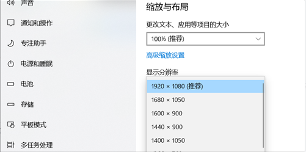

## 数据接入工具(3.0)使用说明

### 概述

- 用于将图片数据推送到AI预审 or AI智检平台

- 违法数据的结构化数据在图片的命名中体现

### 运行环境

- windows-64bit 操作系统

- 内存 >=  4G

- 显示设置:

  - 分辨率 >= 1920 * 1080
  - 文本, 项目大小设置为 100%
  - 

  

### 功能说明

#### 推送地址: https://IP:PORT/client/instesv/illegallogic

- IP: AI预审服务器ip地址

- PORT: 默认是443端口, 可以省略不写

- URI: 默认值

  AI预审: `/client/instesv/illegallogic`

  AI智检: `/client/instesv/recog/testdata`

#### 数据文件夹:

- 选择图片数据所在的目录, 图片数据要求必须在所选目录下, 不得嵌套子目录

#### 字段匹配

- 接入字段索引值
  
  必须输入数字

  根据索引值在图片命名中获取字段数据, 从 0 开始, 遇到分隔符依次加1

- 默认值

  在图片命名中没有体现的字段, 支持填写默认值 (默认值**优先于**索引取值)

#### 辅助配置

- 合成图规则

  只有在AI智检业务下使用

- 序列图规则

  AI预审 and AI智检都有使用

  序号索引值: 序号在图片命名中的索引值

  序号标识: 比如序列图的标识依次是 01, 02, 03 或者是 a, b, c 等

  **补充: 序列图的图片数量是一定的, 如果图片数量不相同, 请分批次导入**

- 分隔符

  字段信息以特定的分隔符连接

  支持自定义分隔符 (自定义分隔符**优先于**选择的分隔符)

- 时间格式

  匹配字段中的违法时间格式, 程序需要统一解析为 UNIX 时间戳

  支持自定义时间格式 (自定义时间格式**优先于**选择的时间格式)

- 线程数量

  数据接入中开启的线程数, 数据量较大时, 可适当增加线程数, 加快数据的接入进度

### 操作说明

#### 步骤

1. 确认推送地址正确

2. 确认数据文件夹内容

3. 确认字段匹配规则

4. 确认辅助相关配置

5. 进行接入测试

   - 接入测试没有通过, 根据提示进行相应调整

   - 接入测试通过之后, 仔细检查字段匹配信息

6. 点击开始接入

### 用户操作举例

#### AI智检合成图接入

- 图片文件

  

- 配置图

  

#### AI智检序列图接入

- 图片文件

  

- 配置图

  

  

###### 完!

